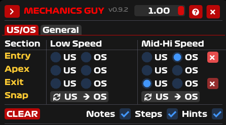
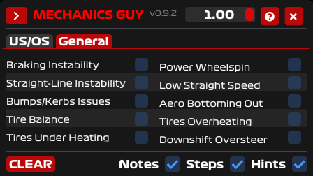
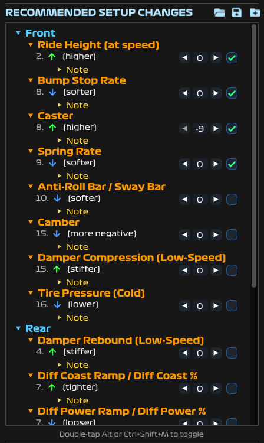
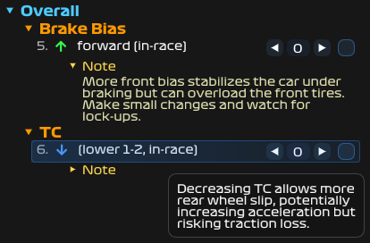
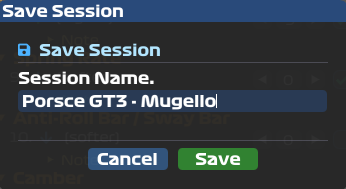
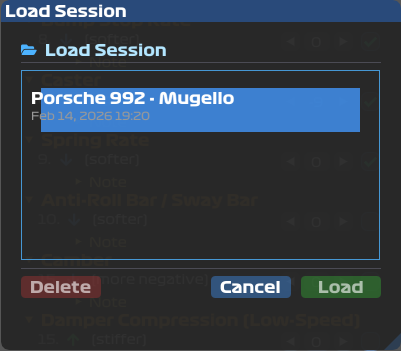
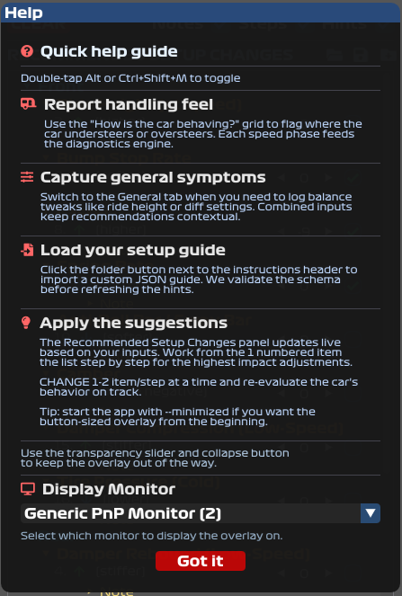

# MechanicGuy - A setup helper Overlay racing companion

An intelligent racing setup assistant that translates your driving experience into expert setup guidance. Based on how you feel the car behaves in different corners, MechanicGuy provides professional-level recommendations to help you fix understeer and oversteer issues through proper setup adjustments.

*Professional racing overlay with intelligent diagnostic matrix and prioritized setup recommendations*

## What It Does

**MechanicGuy** helps you translate your driving experience into actionable setup changes. Based on your assessment of how the car feels in different corner phases and speeds, it provides prioritized setup recommendations to fix understeer and oversteer issues.

Track your progress with checkboxes, get detailed hints for each setup item, and save/load sessions for later. Best of all, the recommendation database is fully configurable via JSON - tailor it to your needs and share with your team!

## Key Features

### Real-Time Overlay Interface
- **Right-side screen positioning** for optimal visibility without blocking race action
- **Always-on-top transparent window** that integrates seamlessly with your sim
- **Minimizable overlay** - collapse when not needed, expand instantly when required
- **Real-time transparency control** - adjust opacity on-the-fly for perfect visibility balance
- **Formula 1 inspired styling** with authentic racing fonts and professional aesthetics
- **Instant hotkey access** (`Double tap Alt` or `Ctrl+Shift+M`) for quick overlay toggling
- **Multi-monitor support** - choose your preferred monitor for overlay placement

### Intelligent Diagnostic System
- **6-Zone Analysis Matrix**: Diagnose handling across Entry/Apex/Exit phases and Low-Speed/Mid-Hi-Speed corners
- **Driver-Feel Based Input**: You assess how the car behaves - simply select where you experience understeer (push) or oversteer (loose)
- **No Telemetry Required**: Works purely on your driving experience and feel for the car's handling characteristics
- **Context-Aware Recommendations**: Different solutions for mechanical vs. aerodynamic-dominated corners

### General Symptoms Diagnosis
Beyond turn-phase diagnostics, track overall car behavior:
- Braking Instability
- Power Wheelspin
- Straight-line Instability
- Bumps & Kerbs Issues
- Aero Bottoming
- Tire Temperature Balance
- Tire Overheating/Underheating
- Downshift Oversteer

### Expert Setup Guidance
- **JSON-driven knowledge base** - easily expandable and customizable for your specific needs
- **Prioritized Recommendations**: Get solutions ranked by effectiveness and ease of implementation
- **Comprehensive Coverage**:
  - Aerodynamics (front/rear wing angles, ride heights)
  - Suspension (ARB settings, spring rates, dampers)
  - Tires (pressures, camber, toe settings)
  - Differential (preload, ramp angles, friction faces)
  - Electronics (TC levels, ABS, brake bias)
  - Mechanical (bushing stiffness)
  - Geometry (ride height, toe, camber)
- **Professional Hints**: Each recommendation includes expert insights on why it works and potential trade-offs

### Progress Tracking
- **Completion Checkboxes**: Mark recommendations as done to track your progress
- **Step Counter**: Track adjustment steps per recommendation (supports negative values for opposite direction changes)
- **Persistent Settings**: Your preferences (hints, notes, steps visibility) are saved automatically

### Session Management
- **Save Sessions**: Save your current diagnostic state and recommendation progress
- **Load Sessions**: Restore previous sessions to continue where you left off
- **Delete Sessions**: Manage your saved sessions with delete functionality

### Customization
- **JSON Configuration**: Customize the entire recommendation database
- **Load Custom Guides**: Import your own `guide.json` files via the folder button
- **Community Ready**: Share custom configurations with other racers

## Quick Start

### Download & Run

1. Download the latest release from [Releases](../../releases)
2. Extract to any folder
3. Run `MechanicGuy.exe`
4. Overlay positions itself on the right of primary monitor
5. Change the preferred monitor in the help/settings if needed
6. Start racing!

### Usage

1. **During Practice/Race**: Notice handling issues (understeer/oversteer)
2. **Select the Problem**: Click the appropriate phase (Entry/Apex/Exit) and turn type (Low/Mid-Hi-Speed)
3. **Get Recommendations**: Review prioritized setup changes
4. **Apply in Garage**: Make adjustments between sessions
5. **Track Progress**: Check off completed changes
6. **Test & Iterate**: Refine until handling improves

## Screenshots

### Diagnostics

#### Turn-Based Understeer/Oversteer Diagnosis

*Select where the car understeers or oversteers by turn phase and speed*

#### General Instability Diagnosis

*Diagnose general symptoms like braking instability, wheelspin, and tire issues*

### Recommendations

#### Recommendations View with Progress Tracking

*Prioritized setup changes with completion checkboxes and step counters*

#### Hints and Notes per Setup Setting

*Detailed hints and notes for each recommendation*

### Session Management

#### Save Session Feature

*Save your current diagnostic state and progress*

#### Load Session Feature

*Load previously saved sessions*

### Help

#### Help Popup

*Built-in help and usage instructions*

## Perfect For

- **Sim Racing Enthusiasts** who can feel car handling nuances and want to learn proper setup techniques
- **League Racers** needing quick diagnostic guidance during practice based on their driving feedback
- **Setup Beginners** wanting to learn how their driving sensations translate to setup changes
- **Experienced Drivers** seeking a systematic approach to translate car feel into technical adjustments

## Racing Science

Built on decades of motorsport engineering knowledge, covering:
- **Mechanical vs. Aerodynamic** grip scenarios
- **Load transfer dynamics** across different corner types
- **Tire contact patch optimization** under various conditions
- **Electronic system integration** for modern race cars

## Racing Tips

- **Focus on one issue at a time** - Don't select multiple problems simultaneously
- **Make incremental changes** - Apply 1-2 suggestions, test, then adjust
- **Test thoroughly** - Run multiple laps to confirm improvements
- **Track conditions matter** - Weather and temperature affect setup effectiveness
- **Document your setups** - Use the session save feature to keep notes
- **Compare lap times** - Use telemetry to verify improvements objectively

## Troubleshooting

### Application Won't Start
- Update graphics drivers (especially OpenGL)
- Install [Visual C++ Redistributable](https://aka.ms/vs/17/release/vc_redist.x64.exe)
- Run as administrator

### Overlay Not Visible
- Press `Ctrl+Shift+M` to toggle visibility
- Check if overlay is minimized to collapsed state
- Adjust transparency slider (might be fully transparent)
- Verify window isn't off-screen (multi-monitor setup)

### Fonts Not Loading
- Ensure `assets/fonts/` directory exists alongside `.exe`
- Verify font files are not corrupted

### Performance Issues
- Close other overlays (Discord, MSI Afterburner, etc.)
- Update GPU drivers
- Reduce overlay opacity (less rendering overhead)

### Hotkey Not Working
- Check if another app is using `Ctrl+Shift+M`
- Run as administrator (global hotkeys require elevation)
- Use alternative: Double-tap `Alt` key

## JSON Configuration System

MechanicGuy uses a flexible JSON-based configuration system that allows you to customize and expand the setup recommendations database.

### How It Works
- **External File Priority**: The executable automatically looks for `guide.json` in the same directory
- **Fallback System**: If `guide.json` is not found, uses embedded default recommendations
- **Hot-Swappable**: Modify the JSON file and restart to see your changes
- **Community Ready**: Easy to share custom configurations with other racers
- **Load Custom Guide**: Use the folder button in the recommendations header to load any JSON guide file

### Customization Options
- **Add New Scenarios**: Create recommendations for specific car types or racing series
- **Modify Priorities**: Reorder recommendations based on your experience
- **Custom Hints**: Add detailed explanations tailored to your racing style
- **Team Databases**: Share optimized configurations within your racing team

## Support the Project

If MechanicGuy helps improve your racing, consider supporting its development:

Your support helps fund continued development, new features, and community resources!

## Future Plans

- Accompany with the setup adjustment pages seen on games
- Add guide for more issues (snap oversteer, US to OS, etc.)
- Getting current setup values from connected simulators
- Telemetry integration for automatic problem detection
- Car/Track specific recommendations
- Integration with popular sim racing platforms
- Support for more racing sims

---

**Built with love for the sim racing community**

*Professional race engineering knowledge, accessible to every driver.*
