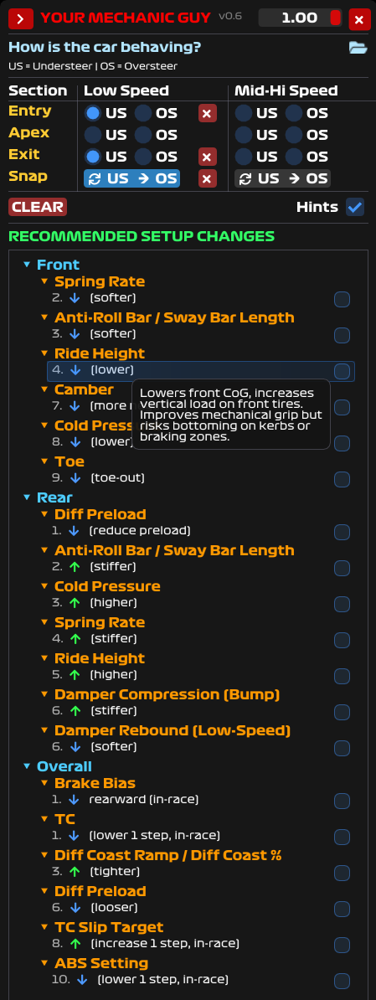

# MechanicGuy - A setup helper Overlay🏎️

An intelligent racing setup assistant that translates your driving experience into expert setup guidance. Based on how you feel the car behaves in different corners, MechanicGuy provides professional-level recommendations to help you fix understeer and oversteer issues through proper setup adjustments.



*Professional racing overlay with intelligent diagnostic matrix and prioritized setup recommendations*

## 🎯 What It Does

**MechanicGuy** helps you translate your driving experience into actionable setup changes. **Based on your assessment** of how the car feels in different corner phases and speeds, it provides prioritized setup recommendations to fix understeer and oversteer issues.
Not only that but you can also track your changes via checkboxes when you are done with a specific change.
Also get some hints for the setup items if you are not sure.

Best part is these are all CONFIGURABLE with a json file. Tailor it to your needs and share with your team! See the [JSON Configuration System](#-json-configuration-system) section below for details.

## ✨ Key Features

### 🎮 **Real-Time Overlay Interface**
- **Right-side screen positioning** for optimal visibility without blocking race action
- **Always-on-top transparent window** that integrates seamlessly with your sim
- **Minimizable overlay** - collapse when not needed, expand instantly when required
- **Real-time transparency control** - adjust opacity on-the-fly for perfect visibility balance
- **Formula 1 inspired styling** with authentic racing fonts and professional aesthetics
- **Instant hotkey access** (`Double tap Alt` while focused or globally with `Ctrl-Shift M`) for quick overlay toggling
  - You can set the global hotkey with any button on your wheel and map with any other 3rd party programs (e.g.: JoyToKey)

### 🧠 **Intelligent Diagnostic System**
- **6-Zone Analysis Matrix**: Diagnose handling across Entry/Apex/Exit phases and Low-Speed/High-Speed corners
- **Driver-Feel Based Input**: You assess how the car behaves - simply select where you experience understeer (push) or oversteer (loose)
- **No Telemetry Required**: Works purely on your driving experience and feel for the car's handling characteristics
- **Context-Aware Recommendations**: Different solutions for mechanical vs. aerodynamic-dominated corners

### 🔧 **Expert Setup Guidance**
- **JSON-driven knowledge base** - easily expandable and customizable for your specific needs
- **Prioritized Recommendations**: Get solutions ranked by effectiveness and ease of implementation
- **Comprehensive Coverage**: 
  - Aerodynamics (front/rear wing angles, ride heights)
  - Suspension (ARB settings, spring rates, dampers)
  - Tires (pressures, camber, toe settings)
  - Differential (preload, ramp angles, friction faces)
  - Electronics (TC levels, ABS, brake bias)
- **Professional Hints**: Each recommendation includes expert insights on why it works and potential trade-offs

### **Data-Driven Intelligence**
- **JSON-based knowledge base** with 100+ setup recommendations that can be expanded and tailored to your specific racing needs
- **Structured symptom analysis** covering all racing scenarios
- **Extensible recommendation engine** - modify the JSON file to add custom setups, new car categories, or track-specific solutions
- **Community-ready architecture** for sharing and importing setup databases

### **Professional Racing Integration**
- **FontAwesome icons** for intuitive visual feedback
- **Formula 1 typography** for authentic racing aesthetics
- **Color-coded hierarchical sections** (Front/Rear/Overall) for quick recognition

## 🚀 Capabilities

### **Smart Recommendations**
Each scenario provides 8-12 prioritized solutions covering:

- **Immediate Fixes**: In-race adjustments (brake bias, TC, ABS)
- **Mechanical Setup**: Springs, ARBs, ride heights, alignment
- **Aerodynamic Balance**: Wing angles, rake, ride height at speed  
- **Tire Optimization**: Pressures, camber, toe settings
- **Differential Tuning**: Preload, ramp angles, friction settings

## 🎯 Perfect For

- **Sim Racing Enthusiasts** who can feel car handling nuances and want to learn proper setup techniques
- **League Racers** needing quick diagnostic guidance during practice based on their driving feedback
- **Setup Beginners** wanting to learn how their driving sensations translate to setup changes
- **Experienced Drivers** seeking a systematic approach to translate car feel into technical adjustments

## 🔬 Racing Science

Built on decades of motorsport engineering knowledge, covering:
- **Mechanical vs. Aerodynamic** grip scenarios
- **Load transfer dynamics** across different corner types
- **Tire contact patch optimization** under various conditions
- **Electronic system integration** for modern race cars

## 🎨 User Experience

- **Smart Positioning**: Overlay appears on the right side of your screen for optimal visibility
- **Flexible Display**: Minimize when racing, expand when analyzing - seamless workflow integration
- **Dynamic Transparency**: Adjust opacity in real-time using intuitive controls
- **Driver-Centric Interface**: Clean, uncluttered design focused on translating your car feel into setup guidance
- **Instant Feedback**: Input your driving sensations, get immediate prioritized solutions
- **Professional Tooltips**: Detailed explanations for every recommendation to help you understand the why
- **Customizable Database**: Modify the JSON configuration file to tailor recommendations to your specific needs

---

*Transform your setup process from guesswork to science. MechanicGuy brings professional race engineering knowledge to every sim racer.*

## 🔧 JSON Configuration System

MechanicGuy uses a flexible JSON-based configuration system that allows you to customize and expand the setup recommendations database.

### **How It Works**
- **External File Priority**: The executable automatically looks for `guide.json` in the same directory
- **Fallback System**: If `guide.json` is not found, uses embedded default recommendations
- **Hot-Swappable**: Modify the JSON file and restart to see your changes
- **Community Ready**: Easy to share custom configurations with other racers

### **Sample JSON Structure**

```json
{
  "version": "1.1",
  "title": "Mechanic Guy Setup companion",
  "description": "+ / – with (stiffer/softer)",
  "symptoms": {
    "understeer": {
      "label": "Understeer (Push)",
      "icon": "arrow-right"
    },
    "oversteer": {
      "label": "Oversteer (Loose)", 
      "icon": "arrow-left"
    }
  },
  "troubleshooting": {
    "understeer": {
      "entry": {
        "low": [
          {
            "section": "front",
            "item": "Starting Pressure",
            "change": "– (lower)",
            "hint": "Lowers front stiffness → better turn-in compliance. Watch inner edge temps rise.",
            "priority": 1
          },
          {
            "section": "front", 
            "item": "Camber",
            "change": "– (more negative)",
            "hint": "Improves contact patch under load. Check outer edge temp — should be 2-3°C hotter than inner.",
            "priority": 2
          }
        ]
      }
    }
  }
}
```

### **Customization Options**
- **Add New Scenarios**: Create recommendations for specific car types or racing series
- **Modify Priorities**: Reorder recommendations based on your experience
- **Custom Hints**: Add detailed explanations tailored to your racing style
- **Team Databases**: Share optimized configurations within your racing team

## ☕ Support the Project

If MechanicGuy helps improve your racing, consider supporting its development:

[](https://buymeacoffee.com/tlgylmz)

Your support helps fund continued development, new features, and community resources!

## 🤝 Contributing

This project represents a passion for sim racing and engineering excellence. While the source code is not yet public, the technology demonstrates the potential for data-driven racing assistance tools.

**Future Plans:**
- Community-driven setup database expansion
- Integration with popular sim racing platforms
- Advanced telemetry analysis features

## 📬 Contact & Updates

Watch this space for updates on the open source release and additional features. MechanicGuy represents the future of intelligent racing assistance tools.

---

**Built with ❤️ for the sim racing community**

*Professional race engineering knowledge, accessible to every driver.*
